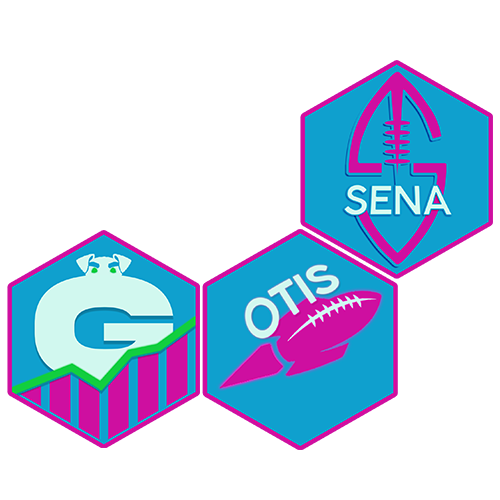

# Nuclear Analytics Lab 

Nuclear Analytics Lab (NAL) manages several packages for Nuclear Fantasy Football.
Packages are developed for data and analysis of college football prospects, the National Football League (NFL), and fantasy football.

**Packages (Early Stage)**

- [{sena}](https://github.com/NuclearAnalyticsLab/sena)
- [{gerald}](https://github.com/NuclearAnalyticsLab/gerald)
- [{otis}](https://github.com/NuclearAnalyticsLab/otis)
